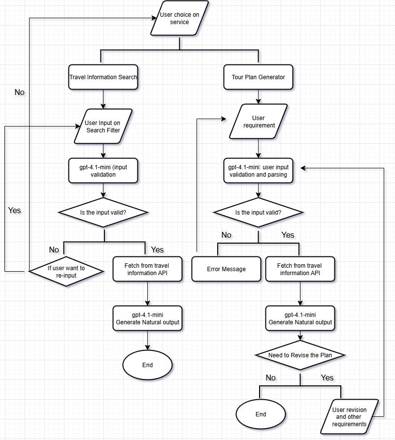

# TourPlanner
Tour Planner using LLMs

---
# Background:
Travel and tours appeal to a vast global market, with millions, if not billions, of individuals embarking on trips, vacations, and business travel annually. Despite the widespread desire to explore, the process of planning a trip is frequently characterized by significant challenges and confusion, particularly for those new to independent travelers. There are many variables that one needs to account for and it can get hectic and strenuous to keep track of everything.

---
# Problem:
Planning a personalized and efficient trip is a complex and often overwhelming task, particularly for new or independent travelers. With countless variables to consider — such as destinations, transportation, accommodation, weather, budgets, interests, and timing — travelers are required to navigate multiple platforms, compare scattered information, and make difficult trade-offs.
This process is often time-consuming, fragmented, and lacks personalization. Existing tools either rely on static templates or provide generic suggestions that do not adapt dynamically to user preferences, changes, or real-time conditions. Furthermore, most applications fail to offer intuitive interactions or explain why certain plans or recommendations are made, limiting user trust and satisfaction.

---
# Solution:
We propose the development of an AI-powered Travel Planning Assistant that leverages a Large Language Model (LLM) to generate personalized, context-aware, and adaptable travel itineraries through natural language interaction.

By combining structured data from real-time APIs (e.g., hotels, weather, attractions) with the reasoning and conversational capabilities of an LLM, the system will allow users to:
- Describe their travel preferences in natural language (e.g., “I want a quiet 4-day solo trip in Kyoto with a focus on culture and food”)
- Receive optimized daily plans with tailored recommendations for attractions, lodging, and transport
Interact and revise their plans through ongoing dialogue (e.g., “Make day 2 more relaxing” or “Swap the museum for an outdoor activity”)
- Access rich multimedia output, including maps, images, descriptions, and links for easy navigation
The assistant will also:
- Rank options based on user constraints (budget, pace, interests)
- Explain recommendations in a human-like way ("This temple fits your interest in history and is close to your hotel")
Support multilingual input and output
- Continuously learn from user interactions to improve plan quality
- This solution offers an intuitive, intelligent, and enjoyable travel planning experience — transforming trip planning from a fragmented chore into an interactive, insightful, and empowering process.

